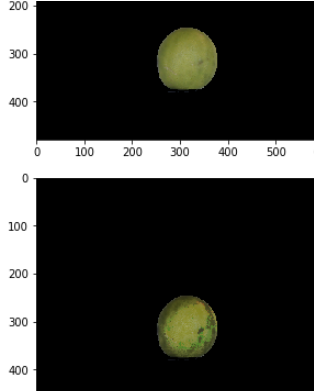
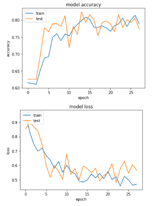

# El presente material son los resultados del proyecto BEIFI Ago-Dic 2019 del SIP20190257

## Algoritmo de procesamiento digital de imágenes
01LemonDiseases.ipynb

### Objetivos 
1. Generar máscaras de limones a partir de una corrección de la base de datos de Lemonator.
2. Resaltar lesiones en las imágenes de limones.

### Resultados
Se resaltan lesiones o manchas oscuras en las imágenes de limones.

### Conclusiones y recomendaciones
Al implementar filtros de tophat se ha mejorado la segmentación de los limones, eliminando mayormente la base del limon en la imagen. Se sugiere implementar el algoritmo de segmentación propuesto en el algoritmo previo desarrollado por Angel Hernandez. Adicionalmente, se sugiere adicional el algoritmo para resaltar lesiones y comprobar resultados en el análisis de CCI.

## Algoritmo para predecir la calidad de limones
01Lemon_Classification.ipynb 

### Objetivos
1. Generar labels de las imágenes.
2. Desarrollar y evaluar un modelo de aprendizaje supervisado.

### Resultados
loss: 0.4730 - acc: 0.7789 - val_loss: 0.5651 - val_acc: 0.7734

### Conclusiones y recomendaciones
Aunque el desempeño del clasificador tiene un resultado adecuado, se identificó un sesgo en el criterio de referencia de la clasificación de limones, debido a que fue una clasificación subjetiva por el usuario. Por lo anterior, se sugiere corregir los labels de la base de datos con una clasificación por medio de valores de CCI (Citrus Colour Index), integrando la investigación de Angel Hernández en el mismo proyecto SIP. 

### References

[1] Christian Szegedy, Sergey Ioffe, Vincent Vanhoucke, Alex Alemi: "Inception-v4, Inception-ResNet and the Impact of Residual Connections on Learning", 2016.

[2] Mark Sandler, Andrew Howard, Menglong Zhu, Andrey Zhmoginov, Liang-Chieh Chen: "Inverted Residuals and Linear Bottlenecks: Mobile Networks for Classification, Detection and Segmentation", 2018.

[3] Serge Obam Y. (2019). Plant Disease Classification with TensorFlow Lite on Android. Source: https://medium.com/@yannicksergeobam/plant-disease-classification-with-tensorflow-2-0-268fe7f72c2a [Date: January 10th, 2020].
